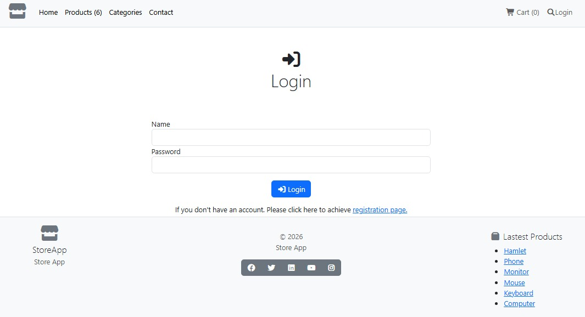
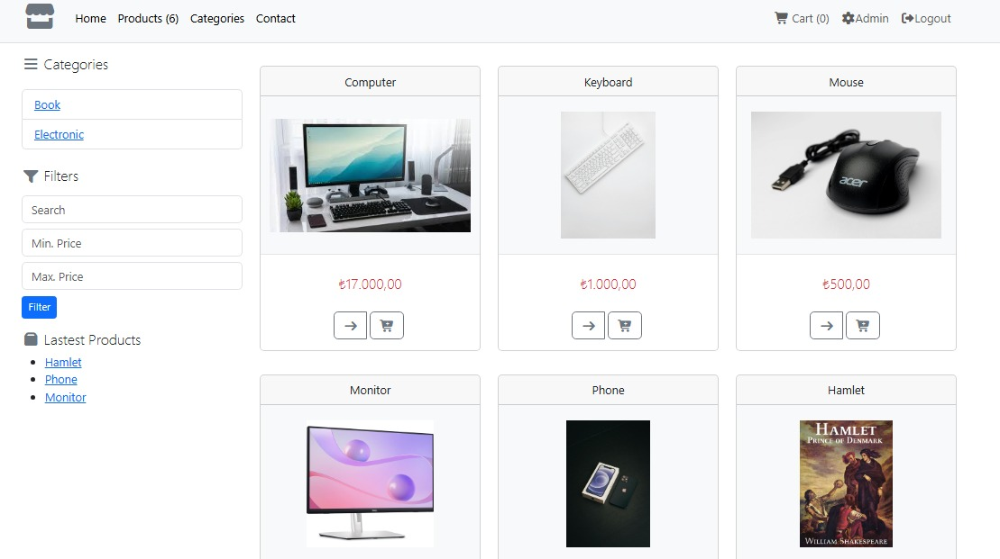
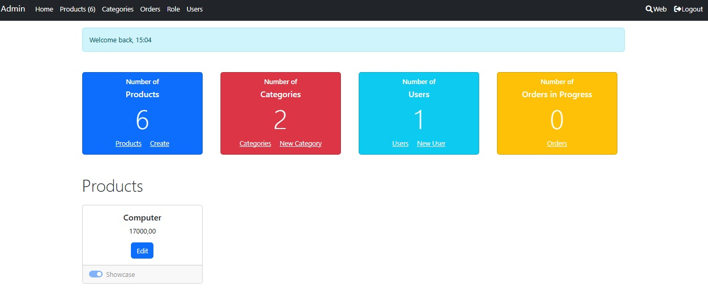
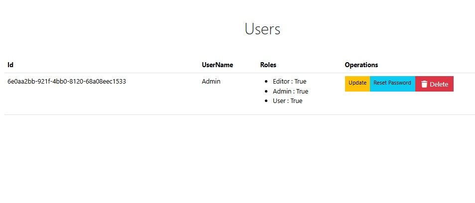
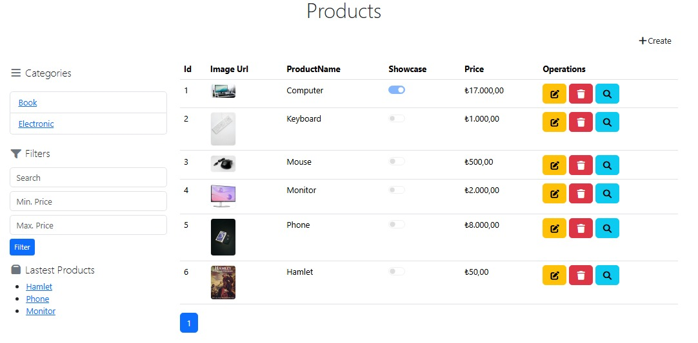

# 🛒 StoreApp — ASP.NET Core MVC E-Ticaret Uygulaması


[](https://www.microsoft.com/sql-server)

ASP.NET Core MVC ile geliştirilmiş, N-Katmanlı mimari kullanan tam özellikli bir e-ticaret web uygulaması. Ürün yönetimi, sepet sistemi, sipariş takibi ve kullanıcı yönetimini içerir.

---

## 📌 Özellikler

- 🛍️ **Ürün Listesi** — Kategori filtresi, arama, sayfalama
- 🛒 **Sepet** — Session tabanlı alışveriş sepeti
- 📦 **Sipariş** — Sipariş oluşturma ve takip
- 🔐 **Kimlik Doğrulama** — ASP.NET Core Identity (Login / Register)
- 🧑‍💼 **Admin Paneli** — Ürün, Kategori, Kullanıcı ve Sipariş yönetimi
- 🖼️ **Resim Yükleme** — Ürünlere görsel atama
- ⭐ **Showcase** — Ana sayfada öne çıkan ürünler

---

## 🏗️ Mimari — N-Katmanlı Yapı

Proje **4 ayrı katman** olarak organize edilmiştir:

```
Store/
├── Entities/           → Modeller (Product, Category, Order, Cart) ve DTO'lar
├── Repositories/       → Veritabanı erişim katmanı (Repository Pattern)
├── Services/           → İş mantığı katmanı (Service Pattern)
├── StoreApp/           → Ana uygulama (MVC Controllers, Views, Areas)
│   ├── Areas/Admin/    → Admin paneli (ayrı routing)
│   ├── Controllers/    → Kullanıcı tarafı controller'lar
│   ├── Components/     → View Component'lar
│   └── Infrastructure/ → Tag Helper'lar, Extension'lar
└── Presentation/       → API Controller'lar (ayrı assembly)
```

### Katman Diyagramı

```
┌─────────────┐
│   StoreApp  │  ← Kullanıcı arayüzü (MVC Views)
└──────┬──────┘
       │ kullanır
┌──────▼──────┐
│   Services  │  ← İş kuralları (ICategoryService, IProductService...)
└──────┬──────┘
       │ kullanır
┌──────▼──────────┐
│  Repositories   │  ← Veri erişimi (EF Core, Repository Pattern)
└──────┬──────────┘
       │ kullanır
┌──────▼──────┐
│   Entities  │  ← Modeller ve DTO'lar
└─────────────┘
```

---

## 🗃️ Veritabanı Modelleri

| Model | Alanlar |
|-------|---------|
| `Product` | ProductId, ProductName, Price, Summary, ImageUrl, CategoryId, ShowCase |
| `Category` | CategoryId, CategoryName |
| `Order` | OrderId, Name, Line1, City, GiftWrap, Shipped, OrderedAt |
| `Cart` | Session tabanlı sepet (CartLine listesi) |

---

## ⚙️ Kullanılan Teknolojiler

| Teknoloji | Kullanım Amacı |
|-----------|----------------|
| ASP.NET Core MVC (.NET 10) | Web framework |
| Entity Framework Core | ORM / Veritabanı yönetimi |
| ASP.NET Core Identity | Kullanıcı kimlik doğrulama |
| SQLite / MSSQL | Veritabanı (yapılandırılabilir) |
| AutoMapper | DTO dönüşümleri |
| Bootstrap 5 | UI / Stil |
| Font Awesome | İkonlar |
| Session | Sepet yönetimi |

---

## 🚀 Kurulum ve Çalıştırma

### Gereksinimler

- [.NET 10 SDK](https://dotnet.microsoft.com/download)
- Visual Studio 2022+ veya VS Code

### Adımlar

```bash
# 1. Repoyu klonla
git clone https://github.com/kullaniciadi/StoreApp.git
cd StoreApp

# 2. Veritabanını oluştur (migration otomatik çalışır)
# appsettings.json içinde bağlantı dizesi SQLite'a ayarlı

# 3. Uygulamayı çalıştır
cd StoreApp
dotnet watch
```

Uygulama `https://localhost:5001` adresinde açılır.

### Veritabanı Bağlantısı

`StoreApp/appsettings.json` dosyasından ayarlanır:

```json
"ConnectionStrings": {
  "sqlconnection": "Data Source=ProductDb.db",
  "mssqlconnection": "Server=(localDB)\\MSSQLLocalDB;Database=StoreApp;Integrated Security=true"
}
```

> SQLite varsayılan olarak kullanılır. MSSQL için `Program.cs`'deki `ConfigureDbContext` extension'ını değiştirin.

---

## 👤 Varsayılan Admin Hesabı

Uygulama ilk çalıştığında otomatik olarak bir Admin kullanıcısı oluşturulur:

| Alan | Değer |
|------|-------|
| Kullanıcı adı | `Admin` |
| Şifre | *(appsettings veya seed data'da tanımlıdır)* |

---

## 📂 Sayfa Yapısı

### Kullanıcı Tarafı (`/`)
| URL | Sayfa |
|-----|-------|
| `/` | Ana sayfa — öne çıkan ürünler |
| `/Product` | Tüm ürünler (filtreleme + sayfalama) |
| `/Product/Get/{id}` | Ürün detay |
| `/Order/Checkout` | Sipariş formu |
| `/Account/Login` | Giriş |
| `/Account/Register` | Kayıt |

### Admin Paneli (`/Admin`)
| URL | Sayfa |
|-----|-------|
| `/Admin/Dashboard` | İstatistikler |
| `/Admin/Product` | Ürün listesi, oluştur, güncelle, sil |
| `/Admin/Category` | Kategori listesi, oluştur, güncelle, sil |
| `/Admin/User` | Kullanıcı yönetimi, şifre sıfırlama |
| `/Admin/Order` | Sipariş takibi |

---

## 🧩 Design Patterns

- **Repository Pattern** — Veri erişim mantığı soyutlandı
- **Service Pattern** — İş kuralları repository'den ayrıldı
- **DTO Pattern** — View ile model arasında veri transferi
- **View Component** — Tekrar kullanılabilir UI bileşenleri (Sepet, Kategori menüsü, Showcase)
- **Tag Helper** — Sayfalama bileşeni için özel tag helper

---

## 📸 Ekran Görüntüleri







---

